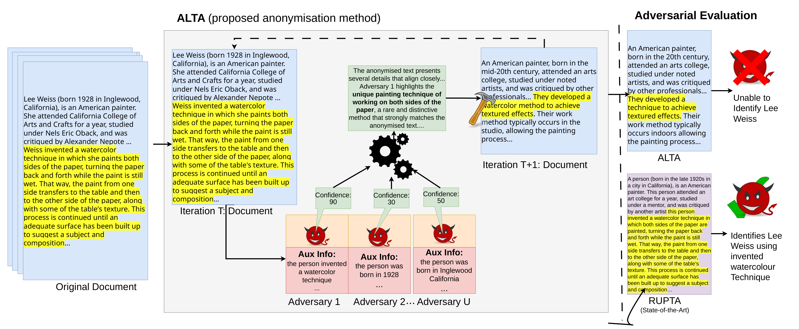

# Auxiliary Linking Textual Anonymisation (ALTA/ALTA-FD)

## Overview
This repo contains code for our two proposed anonymisation methods, **ALTA** (Auxiliary Linking Textual Anonymisation) and **ALTA-FD** (Auxiliary Linking Textual Anonymisation with Fact Distortion). 

Across two datasets, both methods improve privacy beyond existing state-of-the-art adversarial LLM-based approaches. On DB-BIO semantic leakage falls from 43.73 under RUPTA to 9.26/6.41 for ALTA and ALTA-FD, a reduction of over 85%, and is corroborated by reductions in success rate and adversary confidence. On MEDQA, ALTA and ALTA-FD improve upon privacy while matching or improving on every utility measure against Adversarial Feedback.

## Problem
Text anonymisation is dominated by methods that use Personally Identifiable Information (PII) as the unit of protection. Recent work has improved on this by using Large Language Models (LLMs) to extend protection from PII in its surface form to PII that can be inferred. However, text can contain no PII, either surface-level or inferable, and still allow re-identification of an individual. Such documents remain personal data under data protection law, which focuses upon outcome rather than the removal of enumerated identifiers. Yet, current state-of-the-art anonymisation methods would leave these documents unprotected.


## Method
**ALTA** uses an ensemble of adversaries each with auxiliary information that they try to link to the anonymised document. **ALTA-FD** builds upon **ALTA** with a fine-grained rewriting process, through decomposing the text into a list of facts, transforming them through generalisation and perturbation, and reconstructing them into a document. Unlike RUPTA, we improve utility in a task-agnostic way, without conditioning on the original document’s ground-truth label.



*We show our main proposed textual anonymisation method, ALTA and compare its anonymised output to state-of-the-art approach RUPTA. The anonymised document is rewritten iteratively by using feedback from an ensemble of adversaries. The invention of a water colour technique matches Adversary 1's auxiliary information and since this is a highly identifying detail, it is confident it belongs to the same person. This piece of information is then emphasised in a feedback directive used to rewrite the document. Unlike RUPTA, which leaves the description of the invented technique in full, ALTA focuses on generalising the most distinctive pieces of information. This leads to an anonymised document where the adversary can no longer correctly re-identify the individual.*

This repository is adapted from LLM-adversarial text anonymisation method, [RUPTA](https://github.com/UKPLab/acl2025-rupta), which acts as our main comparison on DB-BIO. On MEDQA, our comparison is against [AF](https://github.com/eth-sri/llm-anonymization).

The full thesis motivating our approach, describing our proposed methods and their results can be viewed at `./paper/Anonymisation_Beyond_PII__LLM_Adversarial_Text_Anonymisation_via_Auxiliary_Information_Linkage.pdf` 

## Quick Start
Install Python 3.10.


Git clone this repository.


In the project folder run:
```
python -m venv .venv
source .venv/Scripts/activate
pip install -r requirements.txt
```
Create a `.env` file and add `OPENAI_KEY="sk-.."` with your own OpenAI key.

We provide the settings here that we used to run **ALTA** and **ALTA-FD** on DB-BIO and MEDQA.
### ALTA
#### DB-BIO
```
python main.py \
    --run_name dbbio \
    --root_dir root \
    --dataset_path ./benchmarks/Wiki_People/test.jsonl \
    --strategy aux_linking \
    --language wiki \
    --pass_at_k 1 \
    --max_iters 5 \
    --pe_model gpt-4o \
    --ue_model gpt-4o \
    --act_model gpt-4o \
    --parser_model gpt-4o \
    --seed 42 \
    --tau 50 \
    --u 5
```
#### MEDQA
```
python main.py \
    --run_name medqa \
    --root_dir root \
    --dataset_path ./benchmarks/medqa/test.jsonl \
    --strategy aux_linking \
    --language medqa \
    --pass_at_k 1 \
    --max_iters 5 \
    --pe_model gpt-4o \
    --ue_model gpt-4o \
    --act_model gpt-4o \
    --parser_model gpt-4o \
    --seed 42 \
    --tau 40 \
    --u 5
```

### ALTA-FD
#### DB-BIO
```
python main.py \
    --run_name dbbio \
    --root_dir root \
    --dataset_path ./benchmarks/Wiki_People/test.jsonl \
    --strategy aux_linking_fact_distortion \
    --language wiki \
    --pass_at_k 1 \
    --max_iters 5 \
    --pe_model gpt-4o \
    --ue_model gpt-4o \
    --act_model gpt-4o \
    --parser_model gpt-4o \
    --seed 42 \
    --tau 70 \
    --u 5
```

#### MEDQA
```
python main.py \
    --run_name medqa \
    --root_dir root \
    --dataset_path ./benchmarks/medqa/test.jsonl \
    --strategy aux_linking_fact_distortion \
    --language medqa \
    --pass_at_k 1 \
    --max_iters 5 \
    --pe_model gpt-4o \
    --ue_model gpt-4o \
    --act_model gpt-4o \
    --parser_model gpt-4o \
    --seed 42 \
    --tau 60 \
    --u 5
```

### Reproducibility
We use the random seed 42 throughout the pipeline. Despite seeding, GPT API calls are not fully deterministic and since later stages depend upon earlier outputs, exact anonymised text can vary between runs of the same document.


## Adding a new dataset
Datasets are plain `.jsonl` files. The only field the ALTA / ALTA-FD rewriting loop itself reads is `text` which is the document to anonymise. Every other field on a line is left untouched and written alongside the pipeline's own output, so it's safe to carry along IDs, labels, or any metadata your own downstream code will need later.

To add a new dataset:
1. Create `benchmarks/<your_dataset_name>/<your_file_name>.jsonl`, with each line a JSON object containing at least a `text` field.
2. Duplicate `generators/rewriter.py` (e.g. to `generators/<your_dataset>_rewriter.py`) and rename the `ReWriter` class. This is the `Generator` implementation the loop calls into for prompting the LLM. `generators/med_rewriter.py` is a second example of one of these. 
3. Inside your rewriter, decide if you want to use the generic prompts in `prompts/agnostic_prompt.py` or design your own domain specific ones. For ALTA consider changing `aux_privacy_rewriting_instruction` to be domain specific. For ALTA-FD decide the following:
- For `fact_transformation_instruction` and `fact_rewriting_instruction` do you want to provide the original document's inferences and conclusions so that these are better preserved during fact distortion?
- For `document_rewriting_instruction` do you want to provide the original document as a structural reference, to better preserve the phrasing and wording of it?
4. Pick a new, unique `--language` value for your dataset (not `wiki` or `medqa`) and register it in `generators/factory.py`'s `generator_factory` with an `elif` that instantiates your new class.
5. Run `main.py` with `--dataset_path` pointing at your new file, `--language` set to your new value and `--run_name` the directory inside `root` which anonymisation logs will be saved to. Note the anonymisation log file contains only `--act_model` in its filename, which is the model used for rewriting. 
6. When running the anonymisation, each document's facts will first be extracted and are stored at `facts/<language>_facts.jsonl`. On later runs, these cached facts will be used again (matched by line position to each document). Delete them if you edit your dataset or want the facts re-extracted.

Note: ALTA and ALTA-FD were designed and evaluated on written prose of celebrity biographies (DB-BIO) and medical vignettes (MEDQA). Performance on other text types is untested. Privacy threshold `tau`, number of adversaries `u`, and adversarial/rewriting prompts may require retuning.

## Changing Models
Models are implemented as classes in `generators/model.py` and looked up by name in `generators/factory.py`'s `model_factory()`. The pipeline currently only works with GPT-style chat models reachable through an OpenAI-compatible API.

To add a new model:
1. If it needs a new API key or endpoint, add it to `credentials.py` (and the key to your `.env` file, e.g. `MY_PROVIDER_KEY="..."`).
2. Add a class in `generators/model.py` that inherits from `GPTChat` (or `GPT5Chat` if a GPT-5 model) and set up `self.client` in `__init__`, using the API key and endpoint you wish to use (see `LLama` for a minimal example):
    ```python
    class MyModel(GPTChat):
        def __init__(self, name, seed):
            super().__init__(name, seed)
            self.client = OpenAI(
                api_key=credentials.my_api_key,
                base_url=credentials.my_endpoint,
            )

        def print_usage(self):
            print(f"*******{self.name}*******\nPrompt tokens: {self.prompt_tokens}\nCompletion tokens: {self.completion_tokens}")
    ```
3. Register the model name(s) in `generators/factory.py`'s `model_factory()` (use the exact name needed by the API):
    ```python
    elif model_name in {"my-model-name"}:
        return MyModel(name=model_name, seed=seed)
    ```
4. Use it by passing your model name to any or all of `--pe_model`, `--ue_model`, `--act_model`, or `--parser_model` when doing a run.

## Running Evaluation

### Privacy
#### Semantic Leakage (DB-BIO, MEDQA)
Our main privacy metric is [semantic leakage](https://arxiv.org/abs/2504.21035) which is in a separate [repo](https://github.com/ruixin31/false-sense-privacy). Reformat the anonymisation log according to their requirements so that `text` corresponds to the original and `final_text` the anonymised document. Review their repo and README for exact usage.

#### Success Rate (DB-BIO) / Confidence Score (DB-BIO)
Both come from one run of `main.py` with `--strategy test-acc` pointed at the output `.jsonl` of a completed ALTA/ALTA-FD run:
```
python main.py \
    --run_name dbbio_eval \
    --root_dir root \
    --dataset_path ./root/<run_name>/<run_file>.jsonl \
    --strategy test-acc \
    --language wiki \
    --pe_model gpt-5.4 \
    --seed 42
```
This writes the `success_rate`, the per-document `confidence_score` and the average confidence score, `rank_avg`. Further statistics can be obtained from:
```
python evaluation/privacy/person_confidence.py root/dbbio_eval/<eval_results_file>.jsonl
```

### Utility
#### DB-BIO Classification Accuracy


- [Download the classifier](https://drive.google.com/file/d/1DqG9wUa0q6-qz-SR2pzxB9QVMmez4teU/view) and put the directory containing the trained model `bert_cls_sample3`,  into `./root`

- Convert the anonymisation log to be usable for the classifier by `python utils/convert_for_classifier.py ./root/<run_name>/<run_file>.jsonl`

- Run the following, pointing `train_file`, `validation_file`, `test_file` at `./root/<run_name>/CLEAN_text.jsonl`


```
python ./evaluation/utility/run_classification.py \
--model_name_or_path ./root/bert_cls_sample3 \
--train_file ./root/<run_name>/CLEAN_text.jsonl \
--validation_file ./root/<run_name>/CLEAN_text.jsonl \
--test_file ./root/<run_name>/CLEAN_text.jsonl \
--metric_name accuracy \
--text_column_name anonymised_text \
--label_column_name label \
--do_eval \
--do_predict \
--max_seq_length 512 \
--per_device_eval_batch_size 8 \
--output_dir ./root/bert_cls_sample3/eval_output \
--report_to none \
--ignore_mismatched_sizes
```

A file `./root/<run_name>/eval_results.jsonl` will be created that details the classifier accuracy and loss.

#### MEDQA Question Accuracy
Run the same `test-acc` command and script as Success Rate above, but with `--language medqa` and `--dataset_path` pointed at a completed MEDQA run's output. For MEDQA the `success_rate` field it writes *is* question accuracy (whether the medical question can still be answered correctly using the anonymised text); `confidence_score` there is how confidently the correct answer is guessed.
```
python main.py \
    --run_name medqa_eval \
    --root_dir root \
    --dataset_path ./root/<run_name>/<run_file>.jsonl \
    --strategy test-acc \
    --language medqa \
    --pe_model gpt-5.4 \
    --seed 42
```


#### MAUVE
Run `python evaluation/utility/compute_mauve.py ./root/<run_name>/<run_file>.jsonl`. It reads the `text`/`final_text` fields directly, scores across seeds 1-3, and writes `./root/<run_name>/mauve_results.jsonl` with the per-seed scores, mean, and std next to the input file.

#### Readability
Run ```python evaluation/utility/readability.py ./root/<run_name>/<run_file>.jsonl ./root/<run_name>/readability.jsonl --text-field final_text```. It reads the anonymisation file, takes the text from `--text-field` and evaluates readability per document alongside the reasoning for each score.

## Results
All results reported are located in `./final/<dataset>/<method>/results` for each dataset and method that we use. RUPTA's folder is named `reflexion`. The full anonymisation logs are contained as `.jsonl` files within each.

## Cite
This work was completed as part of an MSc dissertation and currently is not published elsewhere. Please use the following citation:

```bibtex
@mastersthesis{dunne2026anonymisation,
  title  = {Anonymisation Beyond PII: LLM-Adversarial Text Anonymisation via Auxiliary Information Linkage},
  author = {Dunne, Joseph},
  school = {University of Edinburgh, School of Informatics},
  year   = {2026},
  type   = {MSc Dissertation}
}
```